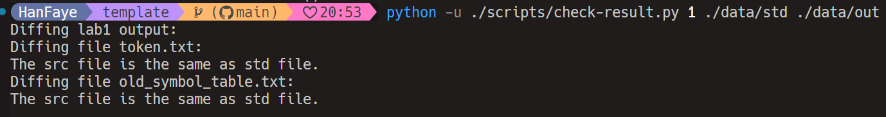
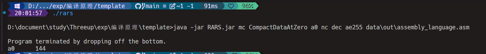

https://compiler-6bi.pages.dev/

## 脚本说明
- remove.py:删除data/out目录下的指定文件
- compare.bat:比较标准输出与实际输出
- rars.bat:rars执行data\std\assembly_language.asm

## exp1 Output


## exp2 Output


## exp3 Output


## exp4 Output
##### ASM文件

##### RASS执行结果

##### RARS命令行执行结果

```
int result;
int a;
int b;
int c;
a = 8;
b = 5;
c = 3 - a;
result = a * b - ( 3 + b ) * ( c - a );
return result;
```
```asm
.text
   li t0, 8
   li t1, 5
   li t2, 3
   sub t3, t2, t0 ##3-a
   mv t4, t3 ##3-a
   mul t5, t0, t1 ## a*b
   addi t6, t1, 3 ## 3+b
   sub t2, t4, t0 ## c-a
   mul t2, t6, t2 ## (3+b)*(c-a)
   sub t2, t5, t2 ## a * b - ( 3 + b ) * ( c - a );
   mv t2, t2
   mv a0, t2

```


## improve
- 对于连加，每次从nowp（包括nowp开始往下找）会不能通过。因为每次查找都是从nowp（包括nowp往下查找的）。所以对于a+b这样第一条并不能对a或b进行替换(因为ab在>=nowp中出现过,所以不能替换。造成没有可用的寄存器)。但实际上是可以的。

- 但是如果从nowp+1开始找，那目标寄存器可能夺取参数寄存器的映射。先找到目标寄存器，再找参数寄存器时候可能会造成参数寄存器映射的丢失。
$ SUB \$0, \$1, \$2$。1和2已经有寄存器映射。假设已满，寻找0的映射的时候（1和2最后一次使用是在nowp），可能会改动1和2的映射。
- 解决方法：
  - 从nowp+1开始寻找
  - 先将参数寄存器映射保存下来，即先找到参数寄存器映射，再从nowp+1开始寻找目标寄存器的映射。具体查看Asmsentence的静态构造函数。result都是最后一个获取的。
  - 这样既可以保证连加的实现。也可以避免目标寄存器对参数寄存器映射造成影响。